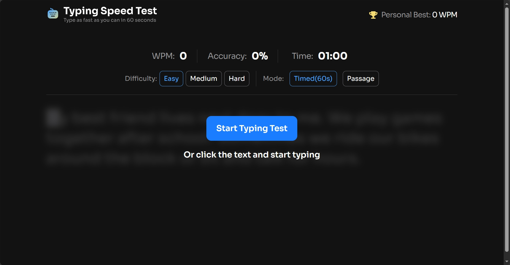

# Frontend Mentor - Typing Speed Test solution

This is a solution to the [Typing Speed Test challenge on Frontend Mentor](https://www.frontendmentor.io/challenges/typing-speed-test). Frontend Mentor challenges help you improve your coding skills by building realistic projects.

## Table of contents

- [Overview](#overview)
  - [The challenge](#the-challenge)
  - [Screenshot](#screenshot)
  - [Links](#links)
- [My process](#my-process)
  - [Built with](#built-with)
  - [What I learned](#what-i-learned)
  - [Continued development](#continued-development)
  - [Useful resources](#useful-resources)
- [Author](#author)
- [Acknowledgments](#acknowledgments)

## Overview

### The challenge

Users should be able to:

- View the optimal layout for the interface depending on their device's screen size
- See hover and focus states for all interactive elements on the page

### Screenshot



### Links

- Solution URL: [Solution](https://github.com/SoulOfMo/typing-speed-test)
- Live Site URL: [Live Site](https://typing-speed-test-neon-tau.vercel.app/)

## My process

### Built with

- Semantic HTML5 markup
- CSS custom properties
- Flexbox
- CSS Grid
- Mobile-first workflow
- JavaScript (ES6+)
- React
- React Hooks
- Custom React Hooks
- Local Storage API
- Utility functions
- Component-based architecture
- Tailwind CSS
- Vite
- Framer Motion

### What I learned

Working on this project helped me improve my understanding of React state management, custom hooks, and side effects. I learned how to structure complex logic inside reusable hooks while keeping components clean and focused on UI rendering.

One of the biggest things I learned was how to manage timers correctly with `useEffect` and avoid issues like stale state, unnecessary interval recreations, and side effects running during render.

I also improved my understanding of derived state by calculating values like WPM and accuracy from existing state instead of storing unnecessary duplicated state.

Another major learning experience was separating business logic into utility functions to make the codebase cleaner, reusable, and easier to maintain.

```js
function calculateWPM(correctChars, startTime, mode, timeRemaining, duration) {
  const elapsedMinutes =
    mode === "Timed(60s)"
      ? (duration - timeRemaining) / 60
      : (Date.now() - startTime) / 60000;

  return elapsedMinutes > 0 ? Math.round(correctChars / 5 / elapsedMinutes) : 0;
}
```

This project also helped me better understand controlled inputs, local storage persistence, reusable utilities, and overall React application architecture.

### Continued development

In future projects, I want to continue improving my understanding of advanced React patterns, especially around state synchronization, effect management, and scalable application architecture.

I also want to deepen my knowledge of performance optimization in React, including memoization, reducing unnecessary re-renders, and improving component efficiency.

Another area I plan to focus on is animation and UI transitions to create smoother and more interactive user experiences using tools like Framer Motion.

I also want to continue refining how I structure reusable hooks and utility functions to keep projects more maintainable and scalable as they grow in complexity.

Beyond React, I plan to improve my TypeScript skills and explore backend integration to build more full-stack applications.

### Useful resources

## Author

- Website - [Morin Sultan](https://morin-sultan.netlify.app/)
- Frontend Mentor - [@SoulOfMo](https://www.frontendmentor.io/profile/SoulOfMo)
- Twitter - [@morin_sultan](https://x.com/morin_sultan)

## Acknowledgments
